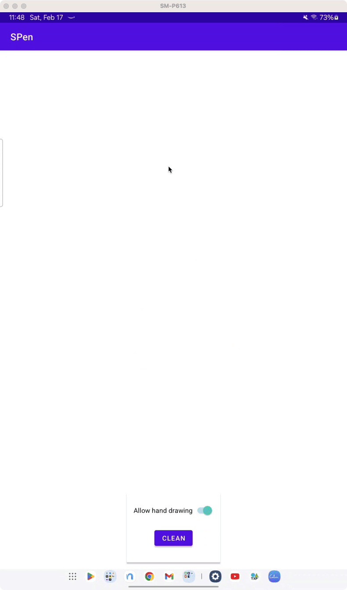

# Stylus Android Spike

This is a sample project that demonstrates how to use Stylus in an Android project.

Details:
- Stylus used is the SPen from samsung s6 lite.
- No need to add external SDK samsung libraries like remote SDK.
- It differentiates between the stylus and the finger.

This was a test because when you try to use the remote SDK from samsung on 
samsung s6 lite it shows:
> This device does not support SPen Remote.

